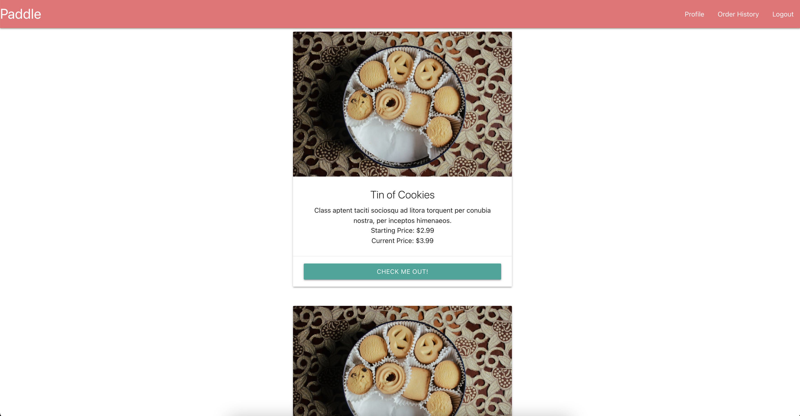
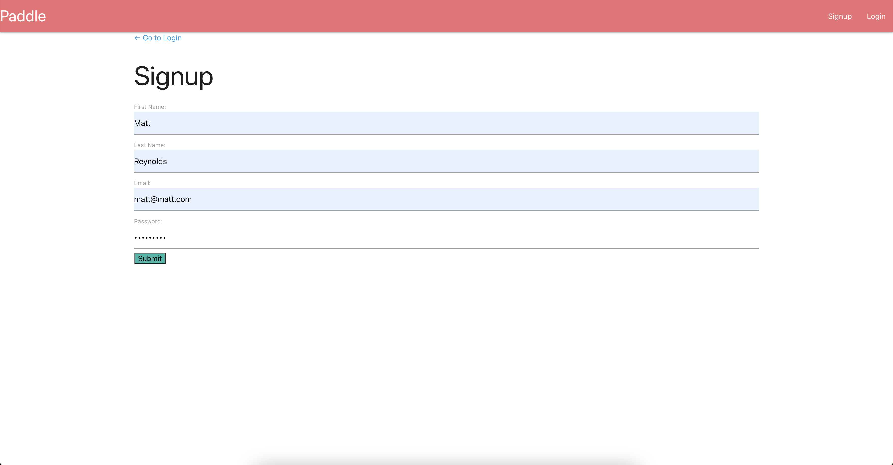
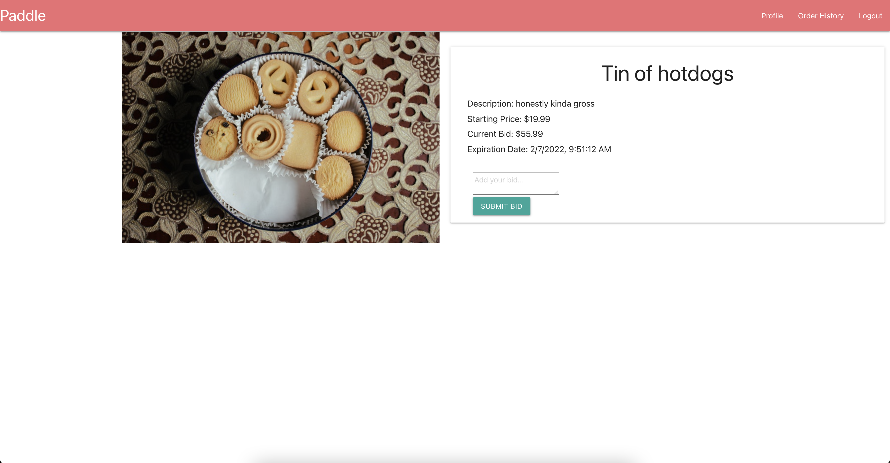
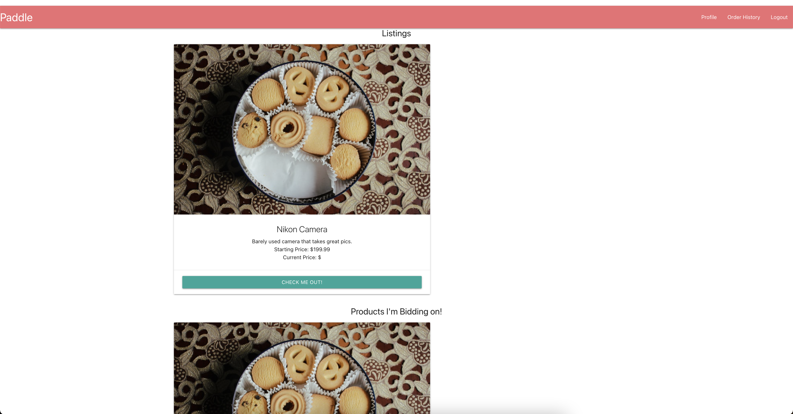
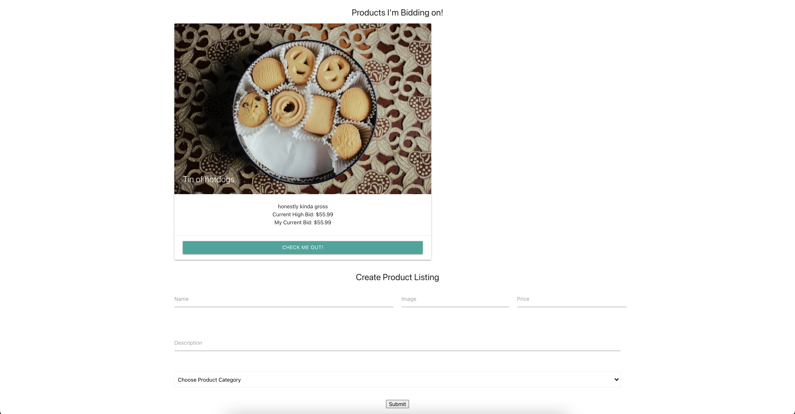

# Better eBay

## Table of Contents
<a href="#description">Description</a>

<a href="#installation">Installation</a>

<a href="#usage">Usage</a>

<a href="#license">License</a>

<a href="#contributing">Contributing</a>

<a href="#questions">Questions</a>

## Description
This application is an auction website designed to facilitate and ease the sales process between fellow users. When coming to this site, user’s can expect a hassle-free experience in which he or she can buy, list, and sell products. Each product listed on this site has an expiration time relevant to the time it was created, and no bids are accepted once the expiration time has passed. So long as the expiration date has not passed, other users can bid on the listed products as many time as they like. There is no limit to the amount or type of products a user can list, so this application ensures user can find or sell anything they are looking for.

## Installation
This project requires MongoDB, Mongoose, React, and Apollo Client. To install these, simply enter 'npm i' into the integrated terminal in the root folder.

On this site, user’s will initially be brought to the homepage where all products can be viewed. Users can click on and observe each item, but they cannot bid on the products until a personal profile has been made. Users can navigate to the Sign Up page through the Nav Bar and subsequently make a profile. Once a profile has been made, users can bid on and sell products through the ‘Add Product’ button on their profile page.

User’s can build personal profiles that house the current products they are bidding on, looking to sell, and have bid highest for. When the expiration date of an item occurs, it will be removed from the main page and added to the respective user’s profile page. After these products have been automatically added to the highest bidder’s profile, that user then can go into their profile, select the products, and begin the checkout process. Whenever a user wants to view his or her previous orders, he or she can navigate to the Order History tab in the Nav Bar to find all previous orders.

## Usage
Once all the dependencies have been installed (see instructions above if not), users can then begin deploying this application. If viewed from the product's code, simply enter 'npm run seed', 'npm run build', and 'npm run develop' into the integrated terminal in the root folder to deploy the application on a local server. 

## License
This application is covered under the MIT license.

## Contributing
Matt Reynolds, Dylan Honeyman, and Colin McHale

## Questions
Our GitHub Profiles: MattReynolds53, dhoneyman, and colinmchale (respectively)

<a href="https://github.com/MattReynolds53">Matt Reynolds GitHub Profile Link</a>

<a href="https://github.com/dhoneyman">Dylan Honeyman GitHub Profile Link</a>

<a href="https://github.com/colinmchale">Colin McHale GitHub Profile Link</a>

Project GitHub Repository: https://github.com/colinmchale/project-3

Project Deployed Heroku Link: https://paddle-auction.herokuapp.com/

## Screenshots

